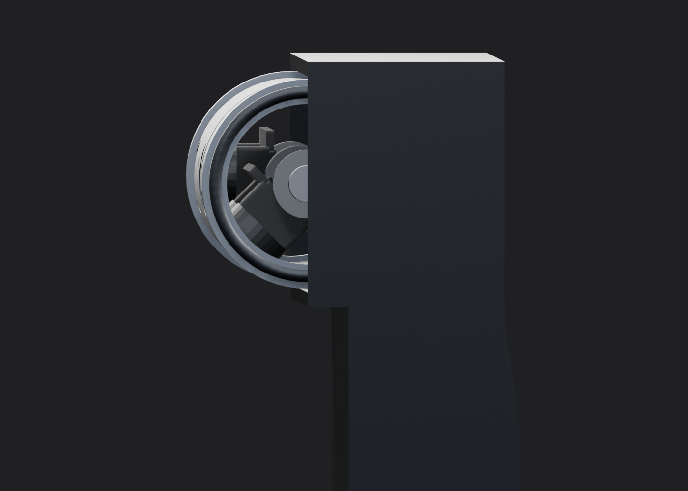
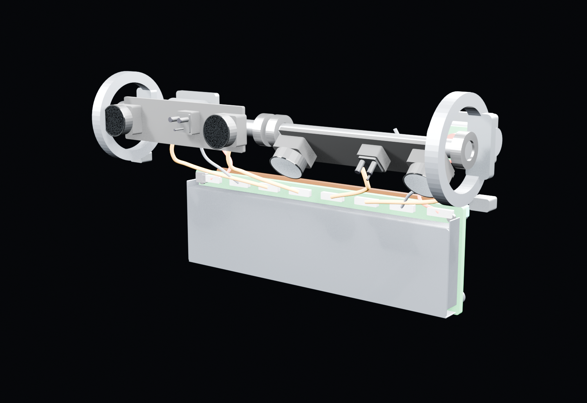
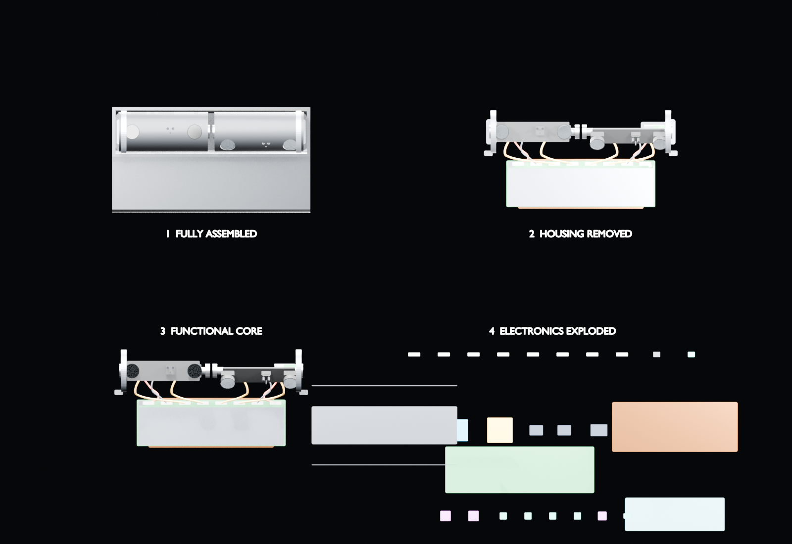
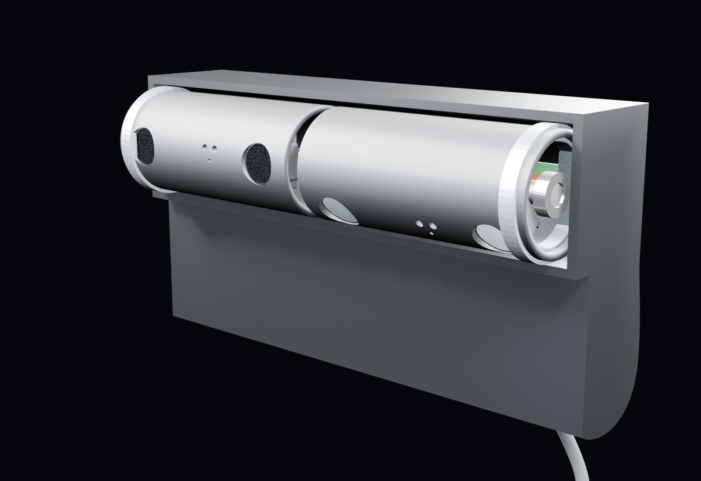
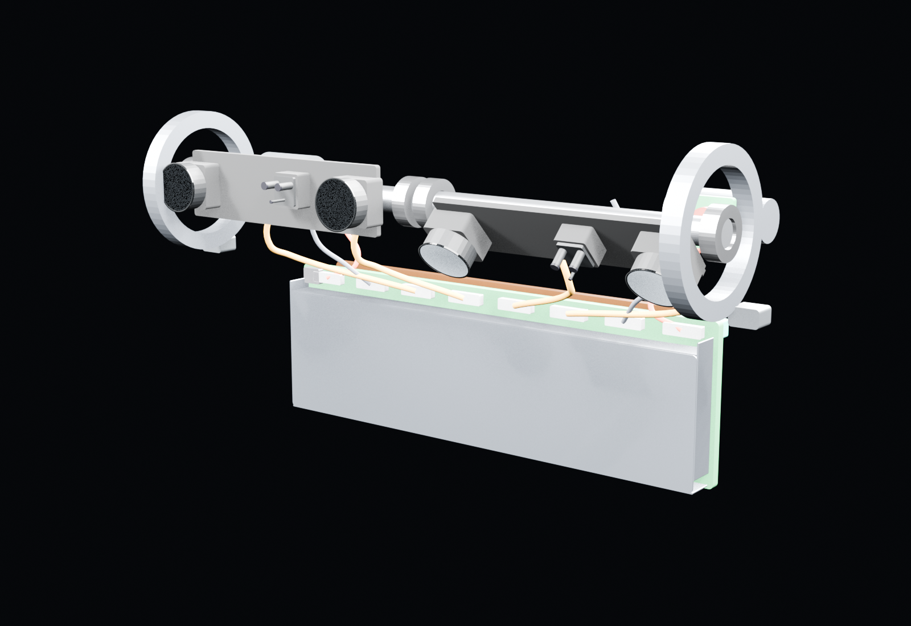
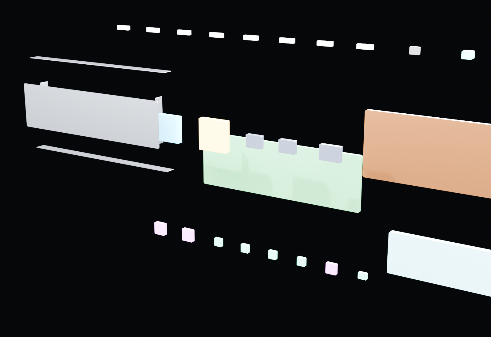

# Blender reference model and visual bill of materials

**Status:** architecture-complete concept model, 5 September 2026
**Authority:** `blender/design_spec.py` and generated `blender/deepreal.blend`

DeepReal now has one active mechanical concept in Blender. The obsolete
"Current" model existed to demonstrate collisions and has been removed. The
rectangular "Compact" chin has also been replaced by the approved curved
electronics compartment, which turns the earlier empty lower curve into
usable packaging volume.

The profile view shows the curved lower compartment continuing behind the
drums. The flat internal stack does not dictate a box-shaped exterior.

## What the major sections do

| Section | What it does | Model status |
| --- | --- | --- |
| Face drum | Aims RGB, IR depth receiver, and structured-light projection at the user. | Shell and optical architecture present; exact optics remain reference/placeholder geometry. |
| Interaction drum | Aims the same sensing classes toward hands and workspace. | Shell and optical architecture present; exact optics remain reference/placeholder geometry. |
| Drum motion | Rotates each drum independently and measures its real angle. | Two motors, pinions, ring gears, axles, four bearings, encoders, brackets, and stops present as concept/reference envelopes. |
| Electronics compartment | Houses the stationary Proof Engine below/behind the drums. | Curved hollow enclosure and populated PCBA volume present. |
| EMI shield can | Encloses the populated PCBA area while leaving a narrow external connector strip at the board edge. | One lid and four perimeter walls present; grounding fingers, seams, and apertures await PCB/EMC design. |
| Thermal path | Moves processor heat into the enclosure so the case can spread it. | Copper spreader and compliant housing pad present; dimensions and thermal performance remain unverified. |
| Interconnect | Carries camera streams, emitter power/control, and motor/encoder signals across limited drum rotation. | Four MIPI, two projector, and two motor/encoder service loops terminate at the external connector strip; exact flex stack and fatigue radii are open. |
| USB-C | Carries host data and intended single-cable power. | Port and cable concept present; connector/mechanical integration remains provisional. |
| Mount | Attaches the device to the display without putting active electronics in the laptop-side plate. | Magnet, steel target plate, and replaceable foam concept present. |

## Visual BOM

| Qty | Named model item | Purpose | Evidence/status |
| ---: | --- | --- | --- |
| 2 | 24 × 54 mm sensor drum | Independently aimed sensing payload | Locked exterior concept; 21 mm assumed usable ID |
| 2 | RGB camera package | Color/identity/interaction imagery | IMX708-class reference geometry |
| 2 | IR global-shutter camera | Structured-light receiver | OV9281-class; package/lens still incomplete |
| 2 | Structured-light projector assembly | Active depth pattern | Reference envelope; final part and eye-safety design open |
| 2 | Internal optical carrier | Holds calibrated drum optics | Concept geometry |
| 2 | Offset geared motor | Drum rotation | Reference gearmotor envelope |
| 2 | Pinion + ring gear pair | Transfers motor torque to drum | Concept gear envelopes, not tooth-level production gears |
| 2 | Drum axle | Defines rotation axis | Concept geometry |
| 4 | Drum bearing | Supports both ends of both drums | Reference envelopes; exact bearing selection open |
| 2 | Magnetic encoder + magnet | Reports measured drum angle | AS5600-class concept |
| 2 | Mechanical travel stop | Limits motion to the intended range | 150° concept; final stop geometry open |
| 1 | Main PCBA | Stationary electronics substrate | 90 × 28 mm architecture envelope |
| 1 | NXP i.MX 95 | Proof Engine compute and hardware-rooted trust | Reference package |
| 1 | CrossLink-NX FPGA | Trusted camera ingress/aggregation | Reference package |
| 2 | LPDDR package | Working memory | Reference package |
| 1 | eMMC package | System storage | Reference package |
| 2 | PF09/PF53 PMIC | Power sequencing and regulation | Reference packages |
| 1 | USB PD controller | Negotiates available USB-C power | Reference package |
| 1 | USB ESD/protection stage | Protects the external high-speed interface | Functional placeholder |
| 2 | Motor driver | Bidirectional motor control | DRV8212-class functional placeholder |
| 2 | Projector driver | Drives active depth emitters safely | Functional placeholder; exact part open |
| 1 | PDM MEMS microphone | Stationary audio observation | Reference package |
| 1 | Case-open tamper switch | Records enclosure-open state | Concept implementation |
| 1 | Five-piece EMI shield can | RF containment over the populated PCBA area | Formed-sheet concept |
| 1 | Heat spreader + thermal pad | Conducts compute heat to rear shell | Concept heat path |
| 4 | Camera flex link | Moves MIPI camera data off rotating drums | Service-loop routing concept |
| 2 | Projector power/control harness | Feeds active depth hardware | Routing concept |
| 1 | USB-C receptacle and cable | Host data and power | Provisional mechanical concept |
| 1 set | Magnet/steel/foam mount | Display attachment | Provisional reference stack |

## Four linked presentation views

The Blender file opens to a single labeled overview showing all four versions
together. Larger versions remain available through Blender's scene selector in
the upper-right corner.

1. **Fully assembled** shows the complete enclosure.
2. **Housing removed** retains brackets, standoffs, bearing carriers, and the
   rest of the internal mounting hardware. The enclosure-mounted USB-C
   receptacle and external cable are removed with the housing.
3. **Functional core** removes those enclosure supports.
4. **Electronics exploded** separates the board, every populated component,
   the five shield-can pieces, external connectors, heat spreader, and pad.

These are linked Blender instances, not four independently modeled products.
Each presentation object shares its source mesh or curve datablock with the
canonical assembly while retaining a scene-specific transform.

The visible green strip above the shield is intentional: it is the physical
mating zone for the eight drum cable connectors, not an uncovered bank of
processor components. The can covers all modeled processor, FPGA, memory,
power, USB, and driver packages. In production, connector shields/grounds and
the PCB traces passing beneath the top can wall still require EMC design and
testing; “outside the can” does not mean electrically unimportant.

## Intentionally absent

- No battery: DeepReal is host/USB powered.
- No separate TPM or secure element: the baseline uses i.MX 95 EdgeLock.
- No slip ring: limited 140–160° travel uses controlled flex loops.
- No second remote EMI wall: the grounded board-covering can is the baseline;
  EMC testing may change its seams, apertures, and grounding later.

## Validation boundary

`blender/validate_model.py` confirms the named architecture-level subsystems
exist and that no `Current_` or `Compact_` comparison objects remain. Optical
containment checks also run during the scene build. This does **not** certify
manufacturability, signal integrity, EMC, thermal performance, eye safety,
structural strength, cable life, or production tolerances.
