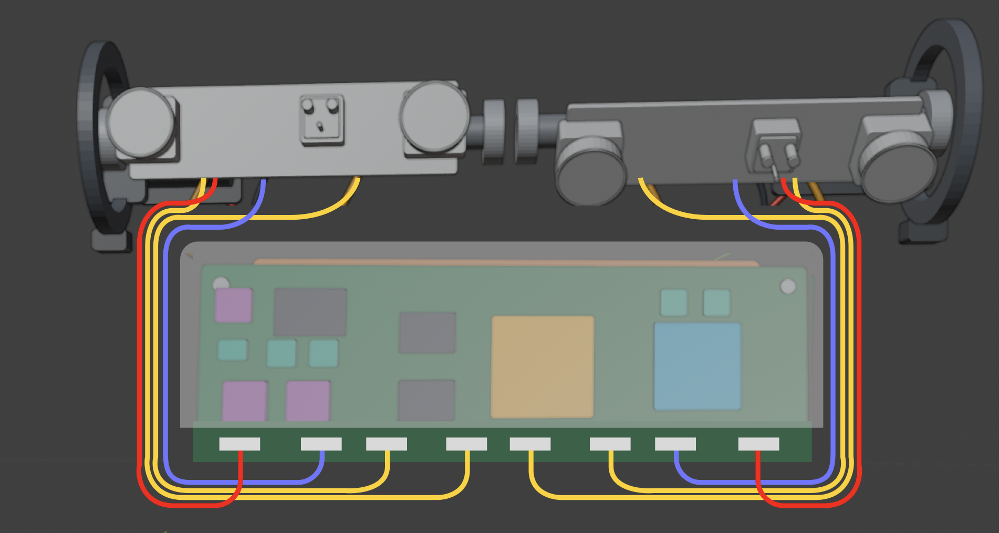

# DeepReal EMI shielding and wiring refactor handoff

**Date:** 6 September 2026

**Status:** approved design direction; Blender implementation still required

**Active branch:** `explore/drum-internals-feasibility`

**Primary artifact:** `blender/deepreal.blend`, generated from the Python files in `blender/`

## Objective

Refactor the DeepReal Blender reference model so the complete main PCBA is
contained by a realistic grounded electronics shield enclosure, while all
drum cables remain serviceable, short, collision-free, and routed in a way
that does not undermine the shielding.

The current five-piece local shield can and exposed connector strip are no
longer the intended architecture. The new source of truth is the full-board
enclosure concept shown below.



The illustration communicates packaging intent, not final dimensions or
verified electromagnetic performance.

## Why this refactor is necessary

The current Blender model places eight drum connectors along the PCBA's upper
edge, approximately 6.5 mm below the drum envelope. Although the existing can
covers the modeled processor, FPGA, memory, power, and driver packages, the
connector transitions and service-loop cables remain exposed toward the
sensor drums.

That is an incomplete EMC architecture. High-speed differential links can
radiate when imbalance creates common-mode current, and cables or connectors
crossing a shield boundary can carry noise outside it. Shield seams,
apertures, grounding, PCB stack-up, and cable construction therefore matter
as much as the visible metal cover.

The Blender model must represent a defensible physical architecture without
claiming that the product has passed EMC testing.

## Approved architecture

### 1. Full electronics shield enclosure

Replace the existing `EMI_Shield_Can_*` arrangement with a thin conductive
enclosure around the PCBA component field.

- Enclose the front, rear, top, left, and right sides of the noisy electronics
  chamber.
- Use a removable lid or two-piece clamshell construction for assembly.
- Keep the metal entirely inside the established product housing envelope.
- Add a perimeter ground-contact concept: a PCB ground ring, closely spaced
  grounding points/vias, and several chassis-bonding tabs.
- Avoid floating metal. Every shield section must visibly share the same
  grounding strategy.
- Treat 0.3-0.8 mm sheet thickness as a visualization range, not a released
  manufacturing specification.

This part should be named **Electronics Shield Enclosure**, not merely an EMI
lid or roof.

### 2. Lower connector apron

Reserve a narrow strip at the bottom of the PCBA as the **connector apron** or
**I/O vestibule**.

- Move drum connectors from the exposed upper edge to the lower boundary.
- Group face-drum connectors near the lower-left side.
- Group interaction-drum connectors near the lower-right side.
- Use downward- or side-facing connectors so cables do not cross the shield
  face.
- Keep USB-C, microphone, tamper, and other non-drum interfaces distinct from
  the two drum banks.
- Do not leave the entire lower side of the enclosure open.

Preferred concept: the shield terminates on a grounded PCB perimeter directly
above the connector apron. The connector bodies remain service-accessible
outside the primary shielded chamber, while their PCB traces cross the shield
boundary through a controlled, ground-referenced region.

If packaging requires the connector bodies themselves to be enclosed, add a
small removable lower service cap with closely fitted cable exits. Do not add
one large open slot across the product width.

### 3. Preserve the thermal path

The processor still needs a continuous conductive path to the housing.

- Do not trap the thermal spreader behind an air gap.
- Either make one shield wall part of the heat-spreading path or use compliant
  thermal pads through the enclosure to the existing rear spreader/housing.
- Keep pressure, electrical isolation, assembly tolerance, and serviceability
  visible as separate concerns.
- Do not remove or obscure the heat-spreader concept merely to close the
  shield.

## Cable architecture

The current Blender curves are routing placeholders. Their colors do not
prove shielding, impedance, conductor pairing, or manufacturability.

### Required routes

Create two compact cable routes, one down each side of the electronics shield:

- **Left route:** face-drum camera, projector, and motor/encoder connections.
- **Right route:** interaction-drum camera, projector, and motor/encoder
  connections.

Each side should contain two visibly distinct lanes:

1. A camera-data lane for high-speed MIPI links.
2. A power/motion lane for projector power and motor/encoder wiring.

Do not place every cable in one undivided bundle. If spacing is limited, use a
thin grounded divider or separate grounded clips. Keep the complete routing
inside the existing housing silhouette.

### Cable rules

- Keep every signal conductor close to its intended return path.
- Do not spread the two conductors of a differential pair apart.
- Avoid large loops, unnecessary cable length, and crossovers.
- Provide only the extra length needed for drum travel, bend radius, assembly,
  and strain relief.
- Route camera data beside a continuous ground reference where possible.
- Keep motor and projector switching currents separated from camera data.
- Keep cable bends smooth through the complete 140-160 degree drum travel.
- Add grounded clamps or shield-termination features at the enclosure boundary.
- Model strain relief at both drum and PCBA ends.

### Intended real-world cable construction

| Connection | Physical intent |
| --- | --- |
| Camera MIPI | Controlled-impedance, ground-backed shielded flex or microcoax |
| Projector power/control | Supply and return routed together; boundary filtering provision |
| Motor/encoder | Twisted or otherwise tightly coupled supply/return conductors; motor suppression provision |
| USB-C | Connector shell bonded at the enclosure boundary |
| Low-speed control | Ground-referenced flex or paired conductors as appropriate |

Do not add common-mode chokes or filters indiscriminately in the visual model.
Represent their reserved locations, but final components require signal-
integrity analysis and pre-compliance testing.

## Blender implementation map

The `.blend` file is generated. Make the source changes in Python and rebuild
the scene rather than hand-editing only the binary.

| File | Required work |
| --- | --- |
| `blender/electronics.py` | Replace the five-piece local can with the full enclosure, ground features, connector apron, and revised connector banks. Preserve the PCBA and thermal system. |
| `blender/interconnect.py` | Replace the current direct upper-edge loops with left/right side routes and separate data versus power lanes. |
| `blender/motion.py` | Reroute both motor/encoder harnesses into the correct side power/motion lane. |
| `blender/support_hardware.py` | Add only the clips, strain relief, or shield supports that must attach to the housing. |
| `blender/presentation_views.py` | Ensure the revised parts appear correctly in all four linked views and are individually visible in the exploded view. |
| `blender/validate_model.py` | Add naming, presence, clearance, containment, and forbidden-legacy checks. |
| `docs/design/blender-reference-model.md` | Replace the obsolete description of the exposed upper connector strip and five-piece can. |

Use one canonical set of components and linked Blender instances for the four
presentation views. Do not create four independently modeled assemblies.

## Required object organization

Use clear semantic names. Exact names may vary, but the hierarchy should be
equivalent to:

```text
Electronics Shield Enclosure
  Shield_Front_Lid
  Shield_Rear_Base
  Shield_Wall_Top
  Shield_Wall_Left
  Shield_Wall_Right
  Shield_Ground_Tabs
  Shield_Lower_Service_Cap        # only if required

Connector Apron
  Face_Connector_Bank
  Interaction_Connector_Bank
  Auxiliary_Connector_Bank

Cable Routing
  Face_Data_Lane
  Face_Power_Motion_Lane
  Interaction_Data_Lane
  Interaction_Power_Motion_Lane
  Boundary_Ground_Clamps
  Drum_Strain_Relief
```

Do not retain legacy objects that only changed name while keeping the wrong
geometry.

## Visual and mechanical acceptance criteria

The refactor is not complete until all of the following are visibly true:

- The shield surrounds the main component field rather than covering only one
  side of part of the PCB.
- No processor, FPGA, memory, PMIC, motor driver, or projector driver protrudes
  through a shield wall.
- No cable or connector intersects shield geometry.
- No cable exits through a large uncontrolled opening.
- Connectors are below the primary shielded chamber and grouped by drum.
- Left and right drum cables do not cross the center unnecessarily.
- Camera-data and power/motion routes are visibly separated.
- Cable paths remain within the enclosure silhouette.
- Nothing increases the product depth or width beyond the approved housing.
- Ring gears remain clear of all optical modules and cable routes.
- The full drum travel envelope remains collision-free.
- The thermal spreader and housing contact path remain present.
- The USB-C shell does not protrude through unrelated internal geometry.
- Fully assembled, housing removed, functional core, and electronics exploded
  views all show the same linked component geometry.
- The default Blender scene opens to the four-view overview.

## Automated validation to add

At minimum, update `blender/validate_model.py` to check:

- Required new shield, connector-bank, cable-lane, and strain-relief objects.
- Absence of obsolete five-piece placeholder-only or comparison objects.
- Every protected electronic package lies inside the shielded volume.
- Every connector lies in the connector-apron zone.
- No connector, cable, optical element, gear, or shield pair has an AABB
  intersection where clearance is required.
- Shield geometry remains inside the approved product envelope.
- Minimum drum-sweep and ring-gear clearances.
- Presentation scenes exist and contain linked instances.

Automated geometry checks are necessary but not sufficient. Inspect renders
from several angles before declaring the work finished.

## Presentation deliverables

Regenerate and review:

1. Four-view overview, used as the default opening scene.
2. Fully assembled product.
3. Housing removed, including required supports and routing clips.
4. Functional core without enclosure-mounted supports.
5. Electronics exploded view showing the PCBA, shield pieces, connector banks,
   thermal pieces, clips, and cable groups separately.
6. One close-up cutaway or transparent render explaining the shield boundary
   and lower connector apron.

The exploded view must separate the shield far enough that the PCB and all
components can be inspected. Do not let the lid hide the PCB in the view whose
purpose is explanation.

## Important limitations

Do not describe this geometry as preventing all radiation or guaranteeing
clean images. The design is intended to reduce coupling and create a credible
EMC architecture. Final performance depends on PCB stack-up, grounding,
impedance control, cable construction, shield seams, filtering, clocking,
motor suppression, housing material, and physical testing.

Required later engineering work includes:

- PCB layout and connector selection.
- Signal-integrity review of every MIPI path.
- Thermal analysis and contact-pressure design.
- Cable-flex and fatigue testing through full drum motion.
- Near-field scanning and pre-compliance emissions/immunity testing.
- Testing with cameras at maximum data rate and motors/projectors switching.

## References

- Texas Instruments, *Suggestions for High-Speed Differential Connections*:
  <https://www.ti.com/lit/pdf/slla104>
- Analog Devices, *EMI-/EMC-Ready SerDes—Basic Test Strategies and Guidelines*:
  <https://www.analog.com/en/resources/design-notes/emiemcready-serdes8212basic-test-strategies-and-guidelines.html>
- Analog Devices, *AN-1109: Recommendations for Control of Radiated Emissions*:
  <https://www.analog.com/en/resources/app-notes/an-1109.html>

## Definition of done

The task is done when the Python-generated Blender model, `.blend` file,
validation script, rendered presentation set, and design documentation all
describe the same full-enclosure and two-lane cable architecture, and the
rendered model passes both automated collision checks and deliberate visual
inspection.
