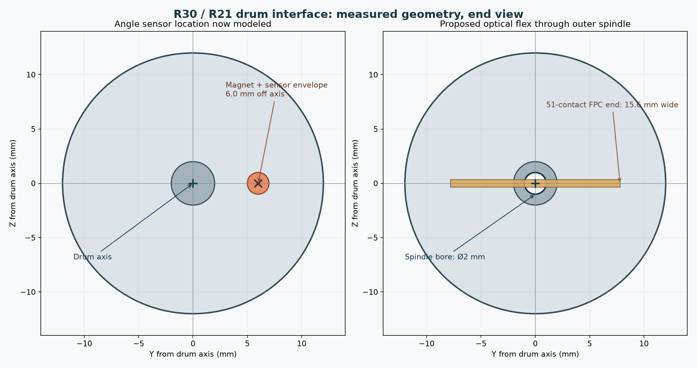

# Drum angle sensing and flex exit: measured interface finding

Status: **mechanical/electrical interface blocked**. Measurements come from the
saved R30 Blender scene, which retains R21 mechanism envelopes. Run
`blender -b -t 4 --python blender/audit_drum_interface.py` to regenerate the
[measurement JSON](drum-interface-measurement-2026-10-09.json) and
`python3 blender/plot_drum_interface.py` for the [end view](drum-interface-measurement-2026-10-09.png).
The current meshes are presentation envelopes, not selected hardware.

## What the current geometry says

| Measurement | Face | Interaction | Meaning |
| --- | ---: | ---: | --- |
| Magnet center from drum axis | 6.0 mm | 6.0 mm | Magnet orbits the axis instead of spinning on it. |
| Sensor package-center proxy from drum axis | 6.0 mm | 6.0 mm | Stationary sensor is also off-axis. |
| Nominal magnet-to-package axial face gap | 0.05 mm | 0.05 mm | Envelope gap is below the reference mounting range. |
| Outer spindle bore diameter | 2.0 mm | 2.0 mm | No route for the specified flat-flex end. |
| Inner bearing bore diameter | 16.9 mm | 16.9 mm | Potential corridor only; surrounding route is absent. |

The [ams OSRAM AS5600L adapter-board guide](https://look.ams-osram.com/m/b03a90ea3dea434a/original/AS5600L_UG000345_2-00.pdf),
page 5, places a diametric magnet centered over or under the Hall array and
gives a 0.5–3 mm magnet-surface-to-package air gap for its reference setup.
It uses a Ø6 × 2.5 mm magnet. The R21 drawing uses a Ø2 × 0.5 mm magnet
envelope. Other magnet sizes may be feasible after field and tolerance review;
the present geometry does not demonstrate that.

The [Hirose connector evidence](../../hardware/electronics/deepreal-main-pcba/head-interface-evidence.json)
specifies a 15.6 mm FPC connector end with 51 contacts on 0.3 mm pitch. Its
contact-center span is 15.0 mm. The specified end cannot pass through the
modeled Ø2 mm outer spindle. A custom narrower moving section, split cable or
different connector system would require a new interconnect design and an
assembly path.

The inner bearing's Ø16.9 mm opening offers only 1.3 mm nominal total width
margin relative to the FPC end. The solid center divider has no cable passage,
and the fixed motor bracket enters the same inner drum region. Width alone
therefore does not establish an inner cable exit or a safe bending loop.

## Design direction for the next CAD iteration

Investigate a centered rotating magnet and stationary sensor at the **outer
cheek**, with a new optical-flex exit through the **inner** bearing region.
That would separate angle sensing from the optical cable. It requires a real
rotating outer hub/magnet support in place of the current hollow-spindle
concept, a center-divider cable passage, and a full-width flex loop that
clears the motor and support webs at every travel angle. The sensor IC's Hall
array location, magnetization and field must be checked against the chosen
package and magnet; package-center measurements here are only a proxy.

If that inner exit cannot meet width and bend requirements, compare a larger
outer cable passage and a compatible angle-sensing architecture. Keep both
options open until a full-scale cable envelope and bearing geometry pass the
pose sweep. The external drum and enclosure appearance need not change for
this internal study.

Do not move U18/U19 on the main-board layout yet. First select a consistent
sensor board location and fixed harness, then update the component register,
schematic partition, connectors and PCB placement together under CR-006.
