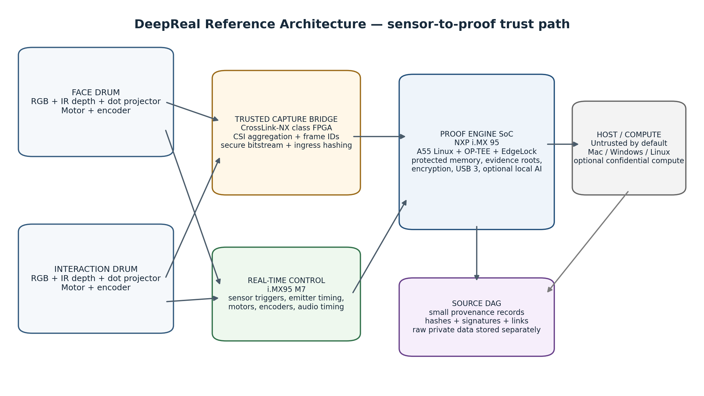
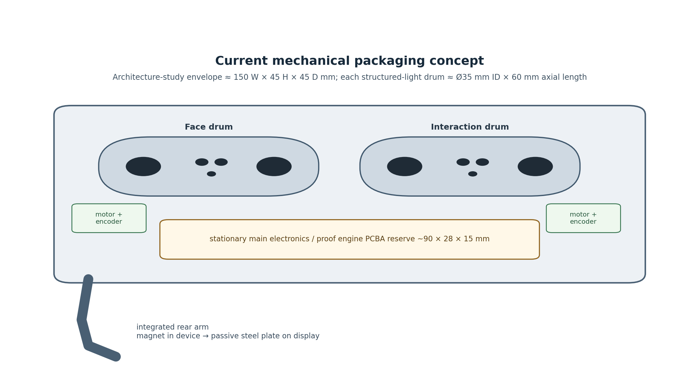
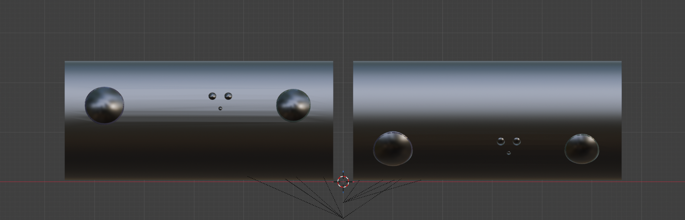
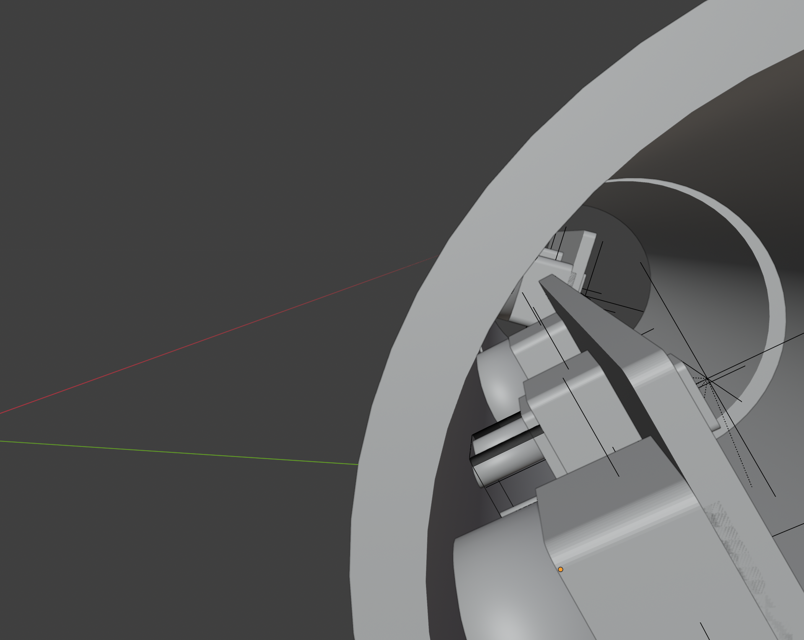
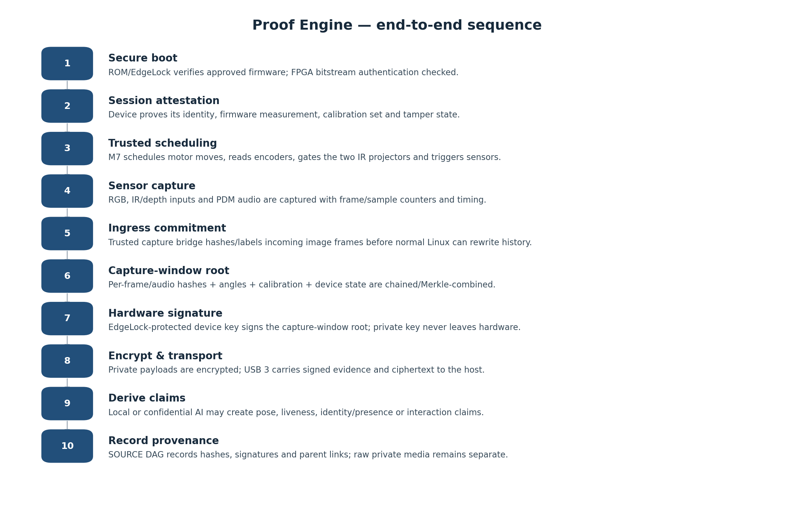
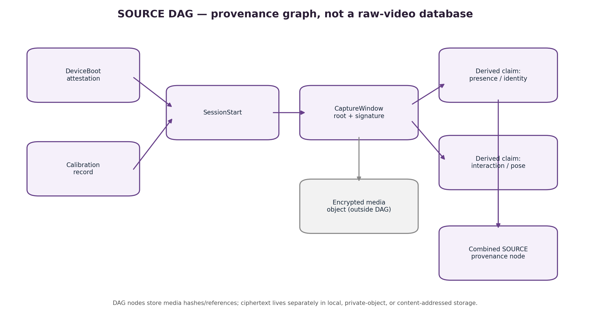

<!-- Canonical Markdown edition of the v0.1 Word source snapshot. -->

[Original Word source](./DeepReal_System_Architecture_Source_of_Truth_v0.1.docx)

# DeepReal

**System Architecture & Hardware Specification**

**SOURCE OF TRUTH — ENGINEERING BASELINE v0.1**

| **Document ID** | **DR-SYS-ARCH-001** |
| --- | --- |
| **Version** | 0.1 |
| **Date** | 26 August 2026 |
| **Status** | Engineering baseline / pre-prototype |
| **Scope** | Mechanical enclosure, sensing, electronics, Proof Engine, security, provenance DAG, BOM and validation plan |
| **Supersedes** | 20 Aug 2026 Working Architecture where this document makes an explicit newer decision |

> **Normative-use rule**
> This document is the current architecture source of truth. Items marked LOCKED are current product decisions. REFERENCE items are the preferred engineering baseline but still require prototype validation. OPEN items must not be silently converted into assumptions in CAD, firmware or BOM work. If another DeepReal document conflicts with this one, this document wins until it is deliberately revised.

## Document control and decision status

DeepReal has evolved quickly across mechanical, optical and security design sessions. This specification consolidates the current state into one controlled baseline and deliberately distinguishes product decisions from candidate components and unresolved engineering gates.

| **Status** | **Meaning** | **How to use it** |
| --- | --- | --- |
| LOCKED | Current architecture decision. | Model, firmware and electrical work should assume this unless this document is revised. |
| REFERENCE | Preferred implementation today. | Design around it, but keep the interface replaceable and validate on hardware. |
| OPEN | Important decision not yet proven. | Reserve space/interfaces; do not optimize the enclosure around an unproven choice. |
| REJECTED / SUPERSEDED | An older assumption no longer governs the design. | Do not propagate it into new work. |

### Contents

- 1. Executive architecture decision
- 2. Product purpose, guarantees and non-goals
- 3. End-to-end system architecture
- 4. Mechanical enclosure and current Blender model
- 5. Sensor-head architecture
- 6. Electronics and chip architecture
- 7. Data interfaces and bandwidth
- 8. Proof Engine architecture
- 9. SOURCE provenance DAG
- 10. Security model and trust boundaries
- 11. Architecture-level BOM
- 12. Power and thermal architecture
- 13. Firmware and software partitioning
- 14. Manufacturing, provisioning and calibration
- 15. Validation gates and prototype plan
- 16. Open decisions and hard blockers
- 17. Superseded assumptions
- 18. References

### Primary internal sources consolidated

- DeepReal Hardware Specification — Working Architecture, 20 August 2026.
- Structured Light vs ToF Architectures for DeepReal, 20 August 2026.
- DeepReal Blender model iterations and accepted optical-integration decisions, 22 August 2026.
- DeepReal design architecture — phased mechanical-model plan.
- Architecture decisions made in the DeepReal discussion through 26 August 2026, including the Proof Engine and SOURCE DAG definitions.

## 1. Executive architecture decision

> **Reference architecture in one sentence**
> DeepReal is a two-drum, motorized RGB-D sensing peripheral in which a secured camera-ingress layer and an NXP i.MX 95-based Proof Engine create signed, encrypted capture commitments before an untrusted host can rewrite the observation; SOURCE then records the resulting proofs and derivations in a hash-linked DAG while private media remains separately encrypted.

### 1.1 The architecture selected for the reference device

| **Subsystem** | **Decision** | **Status** |
| --- | --- | --- |
| Mechanical | Two independent, perfectly cylindrical rotating sensor drums in one stationary housing; integrated rear display arm and magnetic mount. | LOCKED |
| Sensing | RGB + active depth in BOTH face and interaction drums; one digital microphone in the stationary body. | LOCKED |
| Depth method | Discrete structured light is the primary reference path; compact ToF is the parallel fallback. Active stereo IR is not the baseline. | REFERENCE |
| Motion | One motor per drum, each with real angular position feedback. Useful rotation ≈140–160°. | LOCKED / REFERENCE actuator |
| Proof compute | NXP i.MX 95 application processor with TrustZone/OP-TEE and EdgeLock Secure Enclave. | REFERENCE |
| Trusted camera ingress | CrossLink-NX-class secure FPGA bridge for CSI aggregation, frame sequencing and preferably ingress hashing. | REFERENCE / validation required |
| Root of trust | Use i.MX 95 EdgeLock Secure Enclave as baseline device root of trust. No separate TPM is required. | REFERENCE |
| Host | Treat Mac/Windows/Linux host as untrusted transport/UI by default. | LOCKED security principle |
| Transport | USB 3.x over USB-C; product goal remains one cable for data + power. | LOCKED goal / power feasibility OPEN |
| Provenance | Hashes, signatures, capture records and derivation links are recorded in SOURCE DAG; raw private media is stored separately and encrypted. | LOCKED |

### 1.2 Why the architecture changed

The older “secure MCU + secure element + ordinary camera bridge” concept is no longer the preferred baseline because it leaves an uncomfortable gap between sensor output and the first trusted commitment. The current target moves the trusted boundary closer to camera ingress, while using an application-class SoC that can handle multi-camera vision, local inference, encrypted transport and device attestation in one system.

The new reference also removes two older assumptions: a separate TPM is not inherently required, and a discrete secure element is not automatically better than the i.MX 95’s integrated EdgeLock root of trust. Both may remain optional interoperability or research items, but neither belongs in the baseline BOM unless a later threat-model review proves a need.

### 1.3 Non-negotiable architecture invariants

- The laptop must not be trusted to create the original sensor proof.
- The two drums must report measured physical angle, not merely commanded motor position.
- Capture timing, projector state, calibration identity and tamper state must be bound to the evidence record.
- Raw private RGB, depth/IR and audio must not be published merely because a proof exists.
- The SOURCE DAG must represent provenance; it is not the default raw-media database.
- Any AI claim must point back to the capture evidence from which it was derived.
- Unresolved optical, power and security questions must remain explicit engineering gates rather than becoming silent CAD assumptions.

## 2. Product purpose, guarantees and non-goals

### 2.1 What DeepReal is

DeepReal is an open-source trusted sensing peripheral designed to sit at the top edge of a laptop or external monitor. It observes the user and nearby interaction space with synchronized RGB, active depth and audio, while producing cryptographic evidence that binds those observations to a genuine device, approved firmware and a continuous capture sequence.

### 2.2 What the hardware is intended to prove

| **Claim class** | **What DeepReal can establish** | **What it does NOT automatically establish** |
| --- | --- | --- |
| Device origin | A provisioned DeepReal device with a hardware-backed identity produced the signed capture commitment. | That every downstream AI conclusion is correct. |
| Software state | The device booted a measured/approved firmware stack and secure capture configuration. | That every third-party dependency is bug-free. |
| Capture continuity | Frames/audio samples belong to an ordered session with counters and parent commitments. | That the physical scene itself was not staged. |
| Sensor pose | The drums reported measured encoder angles and capture state for the observation. | Perfect mechanical calibration forever; calibration must be maintained. |
| Integrity | Changing a committed payload or metadata breaks the relevant cryptographic hash/signature path. | Confidentiality unless the payload is also encrypted. |
| Provenance | Later claims can be linked back to specific capture evidence. | Truth in the philosophical sense; DeepReal proves what it observed and how claims were derived. |

### 2.3 Core threat assumptions

- The host operating system may be compromised.
- The USB transport may be observed, replayed or manipulated.
- Malware may attempt to insert, remove or reorder frames.
- An attacker may try to boot modified firmware or alter camera/motor configuration.
- Physical access to the enclosure is possible; tamper evidence/detection is therefore relevant.
- Highly invasive semiconductor attacks, decapping and laboratory side-channel extraction are outside the first prototype threat model.

## 3. End-to-end system architecture

Figure 1 — Reference sensor-to-proof architecture. The host is deliberately outside the root of trust.

### 3.1 Functional domains

| **Domain** | **Primary responsibility** | **Trust level** |
| --- | --- | --- |
| Rotating optical payloads | Capture RGB and IR/depth imagery; emit structured-light pattern. | Physically inside device; sensor silicon itself is not the cryptographic root. |
| Motion / timing | Move drums, read encoders, schedule exposure and emitter timing, track sample counters. | Trusted real-time control. |
| Trusted capture bridge | Aggregate MIPI CSI-2 streams, assign stream/frame identity and preferably compute ingress hashes using authenticated FPGA logic. | Trusted after secure bitstream configuration and status verification. |
| Proof Engine SoC | Protected buffers, evidence-window construction, signing requests, encryption, local processing, USB transport. | Trusted subdomains + normal-world Linux separated by TrustZone/resource controls. |
| Host / external compute | UI, storage, optional AI/confidential compute, network transport. | Untrusted by default; may become separately attested. |
| SOURCE DAG | Persistent provenance graph of commitments and claims. | Cryptographically verifiable data structure; storage location may vary. |

### 3.2 Recommended hardware partition

The reference architecture is effectively an S4 design: a small trusted capture layer in front of an application-class secure SoC. This separates “prove the observation” from “interpret the observation.” The FPGA/capture layer is intentionally narrow and deterministic; the larger Linux/AI software stack cannot be allowed to manufacture the original capture after the fact.

## 4. Mechanical enclosure and current Blender model

Figure 2 — Mechanical packaging concept. Dimensions shown are architecture-study envelopes, not final industrial-design dimensions.

### 4.1 Overall enclosure

| **Parameter** | **Current baseline** | **Status / note** |
| --- | --- | --- |
| Architecture-study envelope | ≈150 mm W × 45 mm H × 45 mm D | REFERENCE maximum planning box; should shrink after component validation. |
| Historical envelope | ≈120 × 30 × 24 mm | SUPERSEDED; too small for two current RGB-D drums. |
| Main PCBA keep-out | ≈90 × 28 × 15 mm populated | REFERENCE reserve; one or two-board stack allowed. |
| USB-C zone | ≈15 × 15 mm | REFERENCE packaging reserve. |
| Rear mount | Integrated curved arm, device-side magnet, passive steel display plate, removable foam adhesive | LOCKED architecture; final magnet/adhesive not selected. |
| Mass limit | TBD | OPEN; must be tested against laptop hinge stability. |

### 4.2 The two rotating drums

| **Feature** | **Face drum** | **Interaction drum** |
| --- | --- | --- |
| Purpose | Face/upper-body identity, geometry, liveness, expression inputs | Hands, fingers, keyboard, mouse, nearby interaction space |
| RGB | Required | Required |
| Active depth | Required | Required in the reference device |
| Current depth direction | Structured light | Structured light |
| Useful rotation | ≈140–160° | ≈140–160° |
| Motor | Independent Motor A | Independent Motor B |
| Angle feedback | Required encoder / absolute position sensing | Required encoder / absolute position sensing |

The drums should rotate only the optical payload and lightweight internal carrier. The i.MX 95, FPGA bridge, memory, PMIC, USB circuitry, motor drivers and bulk power components remain stationary in the main housing wherever possible.

### 4.3 Current drum envelope and optical surface treatment

| **Item** | **Current value / decision** | **Status** |
| --- | --- | --- |
| Structured-light drum inner diameter | ≈35 mm | REFERENCE preliminary ID; final OD/wall thickness OPEN. |
| Axial length | ≈60 mm | REFERENCE preliminary. |
| Exterior cross-section | Perfect circle / true cylinder | LOCKED industrial-design decision. |
| Flat facet / recessed panel / raised mesa | None | REJECTED for current design. |
| Large-lens rings / porthole bezels | None | LOCKED visual decision. |
| Lens position | Flush or slightly recessed behind shell opening | LOCKED visual direction; exact optical depth OPEN. |
| Internal mounting | Flat/rigid internal optical carrier hidden inside round shell | LOCKED packaging logic. |
| Shell apertures | Real through-holes cut through cylindrical wall | LOCKED. |
| Flex allowance | ≈5–10 mm bend/clearance per head | REFERENCE; validate actual cable fatigue. |

Figure 3 — Current Blender exterior refinement: two large optics plus the triangular structured-light aperture group, with no raised camera bezel rings.

Figure 4 — Current Blender cutaway: optical hardware is already packaged inside the cylindrical drum. The internal geometry remains architecture-stage placeholder geometry.

### 4.4 Current Blender optical placeholder values

> **Important: these are CAD implementation values, not production optical specifications**
> The current Blender pass uses a shared structured-light assembly behind a three-aperture triangular cluster. It should stay editable until the projector package is selected and optically validated.

| **CAD parameter** | **Current Blender value** | **Interpretation** |
| --- | --- | --- |
| Large-lens exterior ring | Removed | Shell cut itself defines the lens boundary. |
| Large-lens recess | Flat optical window ≈1.2 mm behind the outermost skin, normal to the camera axis | The cylindrical shell remains unflattened; the through-bore and matte sleeve expose a planar, optically neutral camera window. Final FOV clearance must be measured. |
| Shell edge bevel/chamfer | ≈0.2 mm | Current visual/manufacturing treatment. |
| Upper projector-aperture spacing | ≈3.2 mm center-to-center | Increased from ≈2.6 mm during refinement; not yet tied to production optics. |
| Shared projector keep-out depth | ≈6.2 mm | Current editable placeholder after collision check with carrier rail. |
| Triangle layout | Two upper apertures + one smaller lower aperture | Industrial-design placeholder for ONE shared projector/illumination assembly, not three assumed camera modules. |

### 4.5 Motors, encoders and mechanics

| **Item** | **Baseline** |
| --- | --- |
| Actuator count | 2 independent axes: Motor A → face drum; Motor B → interaction drum. |
| Keep-out per actuator | ≈22 × 10 × 22 mm until final actuator selection. |
| Prototype actuator | Micro-servo class such as Kpower P0025 is acceptable for quick fit/motion experiments. |
| Production direction | Micro geared DC motor + absolute magnetic encoder is preferred over a hobby servo. |
| Drive layout | SELECTED: offset micro-gearmotor inside the housing behind each drum; pinion on the motor shaft meshes a ring (or sector) gear fixed to the drum's outboard end (≈3.25:1 in the packaging study). The drum rides its own centerline bearings; the drum-axis encoder closes the loop over gear lash. Coaxial end-pod motors REJECTED: ≈32 mm wider device and larger direct-drive motors. |
| Driver reference | TI DRV8212-class H-bridge, one per brushed motor. |
| Encoder reference | ams OSRAM AS5600-class magnetic absolute angle sensor; higher-resolution SPI alternative can be evaluated. |
| Evidence requirement | Record measured encoder angle with every capture window; do not treat the motor command as the actual pose. |
| Motion/capture policy | For high-precision depth, prefer move → settle → confirm angle → capture. If capturing while moving, mark motion state explicitly. |

### 4.6 Rotating flex architecture

No slip ring is required because each head is expected to rotate only about 140–160°. Use controlled flex loops through the pivots. High-speed image data should use MIPI-rated FPC/micro-coax, with separate or carefully designed conductors for emitter current, motor power, encoder/control and sensor control. The flexes are a reliability-critical component and must be cycle-tested.

## 5. Sensor-head architecture

### 5.1 Full reference sensor payload per drum

| **Function** | **Reference component / class** | **Qty per drum** | **Status** |
| --- | --- | --- | --- |
| RGB imaging | Sony IMX708-class 12 MP module for prototype/mechanical reference; production should use a smaller custom RGB module if possible. | 1 | REFERENCE / exact sensor OPEN |
| IR/depth receiver | OmniVision OV9281-class monochrome global-shutter camera, ≈8 × 8 × 6 mm module reference. | 1 | REFERENCE |
| Structured-light projector | BELICE-850 / Lasermate-class dot projector for prototype research; integrated eye-safety projector such as BELAGO-class should be evaluated for production. | 1 shared optical assembly | REFERENCE / exact part OPEN |
| Projector driver | ams OSRAM AS1170-class high-current LED/VCSEL driver where the selected projector requires an external driver. | 1 | REFERENCE |
| Internal carrier | Rigid calibrated optical bracket inside round shell. | 1 | LOCKED packaging concept |

### 5.2 Structured light is the primary direction

The current primary depth architecture is discrete structured light because high-quality facial geometry is a core requirement. A minimum structured-light system uses an IR camera plus a dot projector with non-zero baseline. The projector casts an invisible pattern; the IR camera observes how that pattern deforms across the scene. The RGB camera is separate and calibrated to the depth coordinate frame.

The physical baseline between projector and IR receiver should be as large as practical within the ≈60 mm drum length. The current industrial design places the depth optic and projector group apart along the drum axis. Exact baseline, FOV overlap and algorithm performance are still OPEN and must be determined on an optical bench rather than from CAD alone.

### 5.3 The triangular projector cluster is not three independent sensors

The current Blender model intentionally shows three small openings in a triangle. This is a visual/packaging placeholder inspired by integrated 3D cameras. The architecture-level BOM still contains ONE structured-light projector/illumination assembly per drum. The three apertures may eventually represent multiple optical sub-windows, an interlock/safety feature, or be reduced to a different arrangement when the actual projector is chosen.

### 5.4 ToF fallback

Compact time-of-flight remains the fallback if structured light cannot meet package, thermal, power, calibration or eye-safety constraints. The Infineon REAL3 IRS1125A-class sensor is the current reference because its ≈10 × 10 mm package plus emitter is much smaller than the RGB module. ToF simplifies mechanical packaging but trades away some of the structured-light geometry characteristics that motivated the current face design.

| **Depth architecture** | **Mechanical fit** | **Optics** | **Compute / calibration** | **Current role** |
| --- | --- | --- | --- | --- |
| Discrete structured light + RGB | Tight but plausible in ≈Ø35 × 60 mm | IR cam + dot projector + RGB; baseline matters | Stereo/projector calibration + depth reconstruction | PRIMARY research path |
| Compact ToF + RGB | Easier | ToF imager + emitter + RGB | Timing/calibration still required | PARALLEL fallback |
| Active stereo IR | More components and baseline | 2 IR cameras + projector + RGB | More camera bandwidth and calibration | NOT baseline today |

### 5.5 Projector interference and eye safety

> **Hard safety requirement**
> Both drums may emit infrared light. The two projectors must be coordinated so one depth receiver is not confused by the other head’s pattern. Eye safety cannot be treated as a software-only feature; emitter selection, driver limits, interlock behavior and fault shutdown must be validated against the applicable laser/photobiological safety standard before human use.

Reference scheduling policy: time-multiplex the projectors. For a face IR exposure, enable the face projector and disable the interaction projector; for an interaction IR exposure, reverse the state. The trusted real-time controller owns this schedule and records projector state in the evidence metadata.

### 5.6 Audio

The reference device uses one digital MEMS microphone in the stationary housing. A PDM microphone is preferred because i.MX 95 exposes PDM microphone inputs. Infineon IM69D130 is a current high-quality reference: active, 4 × 3 × 1.2 mm, PDM output and 69 dB(A) SNR. The microphone does not need to rotate with either drum.

## 6. Electronics and chip architecture

### 6.1 Reference S4 architecture: trusted capture bridge + secure application SoC

The recommended board architecture combines a narrow camera-ingress FPGA with the i.MX 95. This is deliberately different from the older “STM32H5 + secure element” baseline. The goal is to have enough compute and camera I/O for both RGB-D heads while preserving a small, auditable place where image packets become immutable evidence commitments.

| **Chip / block** | **Recommended reference** | **Why it exists** | **Baseline status** |
| --- | --- | --- | --- |
| Main application / Proof Engine SoC | NXP i.MX 95, preferably 15 × 15 mm package derivative | 6× Cortex-A55, Cortex-M7, Cortex-M33/system manager, dual MIPI CSI, ISP, NPU, USB 3, EdgeLock Secure Enclave, protected memory/resource controls. | REFERENCE |
| Trusted camera bridge | Lattice CrossLink-NX class (LIFCL-17/40 family; exact package/topology open) | Aggregate 4 image sensors into i.MX 95 camera links/virtual channels; secure/authenticated FPGA bitstream; frame IDs; target ingress SHA-256 hashing. | REFERENCE / validate throughput |
| DRAM | LPDDR4X or LPDDR5, 4 GB production starting point; 8 GB dev acceptable | Linux, frame buffers, local inference, encoding. | REFERENCE / capacity OPEN |
| Boot / system storage | eMMC 16–32 GB + optional octal SPI NOR | A/B firmware, logs, calibration cache, temporary encrypted buffers. | REFERENCE |
| i.MX 95 power | NXP PF09 + PF53 reference PMIC/regulator pair or equivalent validated design | Reference-board proven supply architecture for i.MX 95. | REFERENCE |
| USB-C PD sink | Infineon CYPD3177 EZ-PD BCR or equivalent | Negotiate available USB-C power; supports 5–20 V PD sink operation. | REFERENCE |
| Motor drivers | 2 × TI DRV8212-class | Independent bidirectional brushed DC motor control with protection. | REFERENCE if brushed gearmotors |
| Drum encoders | 2 × AS5600-class magnetic angle sensors | Measured physical drum pose. | REFERENCE |
| Microphone | 1 × Infineon IM69D130-class PDM MEMS | High-quality single-channel local audio. | REFERENCE |
| Projector drivers | 2 × AS1170-class where needed | Trusted emitter gating/current control, up to 1 A/channel class. | REFERENCE |
| USB/ESD/load protection | Type-C/USB3 ESD, load switches, current sensing | Protect host/device and allow power-domain isolation. | REQUIRED / exact parts OPEN |

### 6.2 Why i.MX 95 is the current lead SoC

- It has two MIPI CSI camera interfaces and an ISP intended for multi-camera vision workloads.
- It includes six Cortex-A55 cores, a real-time Cortex-M7, a low-power/safety Cortex-M33 domain, a 2 TOPS-class Neutron NPU, video processing and USB 3.
- EdgeLock Secure Enclave provides hardware-rooted secure boot, eFuse key storage, cryptography, tamper inputs, secure clock and random-number functions.
- TrustZone/OP-TEE can isolate trusted applications from normal-world Linux, while TRDC/resource-domain hardware exists in the camera and memory architecture.
- NXP publishes current camera, security, power and hardware-design documentation and supports long product-longevity programs.

### 6.3 Roles inside the i.MX 95

| **Compute/security domain** | **DeepReal role** |
| --- | --- |
| Cortex-A55 + Linux | Camera/ISP drivers, depth pipeline, encoding, USB protocol, non-trusted UI/telemetry services, optional local AI. |
| OP-TEE / secure world | Evidence-window finalization, session-key handling, access to protected measurements, signing authorization and sensitive policy. |
| Cortex-M7 real-time core | Motor/encoder control, sensor/projector trigger schedule, capture-state machine, timing counters, watchdog and possibly audio capture pre-processing. |
| EdgeLock Secure Enclave | Device root key, secure boot chain, cryptographic operations, device identity/attestation and protected key storage. |
| TRDC / protected memory controls | Partition camera/memory/peripheral access so normal-world software cannot silently alter pre-commit capture state. |
| NPU/GPU/VPU | Optional face tracking, pose, liveness assistance, local AI, encoding; these accelerators are not themselves the origin-of-capture trust anchor. |

### 6.4 Trusted camera bridge role

DeepReal has four image sensors in the full structured-light configuration (2 RGB + 2 IR). i.MX 95 exposes two physical CSI inputs, so the design needs a multi-camera aggregation strategy. CrossLink-NX is the current reference because Lattice publishes 2→1 and 4→1 CSI aggregation designs, supports small packages, and includes bitstream authentication/encryption plus SHA-256-capable cryptographic resources.

| **Bridge function** | **Target behavior** |
| --- | --- |
| CSI aggregation | Assign each sensor a stable stream ID / virtual-channel mapping and feed the two i.MX 95 CSI receivers. |
| Frame sequencing | Generate trusted per-stream frame counters before the frames reach normal Linux. |
| Ingress hashing | Preferred target: hash frame payload/metadata while it passes the trusted bridge. Throughput must be benchmarked; if insufficient, protected i.MX camera buffers become the hash boundary. |
| Secure configuration | Enable authenticated FPGA bitstream; expose configuration version/digest so it can be included in device attestation. |
| Sensor control | Lock camera mode/configuration under trusted control during an evidence session; normal Linux may request changes but should not silently reconfigure sensors. |
| Physical placement | Keep FPGA stationary on main electronics, not rotating in the drums, unless SI/flex testing forces a different split. |

### 6.5 TPM, external secure element and STM32H5 decisions

| **Older idea** | **Current baseline** | **Reason** |
| --- | --- | --- |
| Separate TPM required | NO | A TPM is useful for standardized platform measurements/quotes, but it is not required to hash video and does not solve camera-ingress trust. DeepReal can add TPM interoperability later. |
| Separate OPTIGA Trust M / ATECC608B required | NO baseline | i.MX 95 EdgeLock already provides the hardware root-of-trust functions needed by the reference architecture. A discrete secure element is optional if an independent credential silo is later justified. |
| Separate STM32H5 required | NO baseline | The i.MX 95 already contains an M7 real-time core plus integrated security. STM32H5 remains a fallback if partitioning, fault isolation or certification goals require an independent supervisor. |

## 7. Data interfaces and bandwidth

### 7.1 Image interfaces

Bare RGB/IR image sensors are not USB devices. They connect by MIPI CSI-2 into the trusted capture bridge and then into the i.MX 95 camera subsystem. The reference transport uses unique stream IDs/virtual channels so the Proof Engine can distinguish face RGB, face IR, interaction RGB and interaction IR without relying on software naming alone.

### 7.2 Recommended prototype capture targets

| **Stream** | **Prototype target** | **Approx. raw payload rate (before CSI overhead)** | **Status** |
| --- | --- | --- | --- |
| Face RGB | 1920×1080 @ 30 fps RAW10 | ≈0.62 Gbit/s | REFERENCE test target |
| Face IR | 1296×816 @ 60 fps RAW10 | ≈0.63 Gbit/s | REFERENCE test target |
| Interaction RGB | 1920×1080 @ 60 fps RAW10 preferred | ≈1.24 Gbit/s | REFERENCE / may reduce |
| Interaction IR | 1296×816 @ 60 fps RAW10 | ≈0.63 Gbit/s | REFERENCE test target |
| Total image payload | Four streams above | ≈3.13 Gbit/s before protocol overhead | Within aggregate capability on paper; validate lanes/FPGA implementation. |

These are prototype engineering targets, not final product requirements. The goal is to force a realistic high-bandwidth design early. Lower-rate operating modes can be added later for power/thermal control.

### 7.3 Audio and control

- PDM microphone connects directly to an i.MX 95 PDM input; convert to canonical PCM for hashing/storage as defined by the capture profile.
- Motor control uses PWM/GPIO through the real-time controller to two H-bridge drivers.
- Encoder reads use I²C/PWM/SPI depending the final sensor; the absolute angle value is evidence metadata.
- Projector drivers are controlled only by the trusted schedule. The state and current/duty profile used for each IR exposure must be recordable.

### 7.4 USB host link

The product goal is one SuperSpeed USB-C cable carrying data and power. The i.MX 95 provides USB 3.0. DeepReal should expose a purpose-built authenticated evidence transport. An optional low-resolution preview/UVC interface may exist for UX, but it must be explicitly non-authoritative unless its content is cryptographically bound to the trusted capture records.

## 8. Proof Engine architecture

Figure 5 — Proof Engine sequence. The cryptographic proof is constructed before the host is trusted with the observation.

### 8.1 Definition

The Proof Engine is not one chip. It is the trusted hardware/software path that takes synchronized physical observations and turns them into cryptographically verifiable evidence. In the reference architecture it spans the authenticated camera bridge, i.MX 95 real-time control, protected capture state, OP-TEE policy and EdgeLock-backed signing.

### 8.2 Boot and device state

1. ROM/secure boot verifies the approved boot chain before the device enters evidence mode.
2. FPGA configuration authentication must succeed; its configuration ID/digest is bound into the device measurement.
3. The device loads a signed calibration bundle for both drums and verifies its hash/signature.
4. Tamper inputs, firmware version and anti-rollback state are sampled.
5. The host may challenge the device and receive a signed attestation before accepting a capture session.

### 8.3 Capture session establishment

A new capture session receives a random session identifier, monotonic sequence state and ephemeral encryption context. Absolute wall-clock time is not assumed trustworthy merely because a laptop reports it. DeepReal should always maintain a hardware monotonic timeline; optional trusted-time anchors can be attached as separate signed records.

### 8.4 Trusted observation schedule

1. Normal-world tracking software may request a target drum angle.
2. The M7 controls the motor and reads the actual encoder angle.
3. For precision depth, the M7 waits for a settle criterion or marks the capture as “moving.”
4. The M7 gates the face/interaction IR projectors so the two structured-light patterns do not interfere.
5. Sensor exposure/frame start, projector state, encoder angle and audio sample ranges are tied to the same session timeline.

### 8.5 Capture commitment

The commitment should be made over canonical sensor bytes and trusted metadata before post-processing can rewrite history. The reference target is to hash image frames at the trusted capture bridge and audio in a protected real-time path. Frame hashes are then combined into a signed capture-window root rather than invoking a private-key signature for every frame.

| **Record field** | **Meaning** |
| --- | --- |
| device_id / certificate_ref | Hardware-backed DeepReal device identity. |
| firmware_measurement | Measurement/version of approved boot chain and trusted capture logic. |
| fpga_config_measurement | Digest/version of trusted camera-bridge configuration. |
| session_id | Random unique capture session identifier. |
| window_sequence | Monotonic capture-window counter. |
| monotonic_time_range | Hardware timeline start/end; separate from untrusted wall time. |
| stream_frame_hashes / Merkle root | Commitments to RGB/IR frames in the window. |
| audio_hash | Commitment to the associated audio sample interval. |
| face_angle / interaction_angle | Measured drum encoder angles. |
| motion_state | Settled/moving plus relevant motor state. |
| projector_state | Which emitter was active, timing/duty profile identifier. |
| calibration_hash | Exact per-device calibration bundle used. |
| tamper_state | Trusted enclosure/security-state bits. |
| previous_window_hash | Continuity link to prior capture window. |
| payload_refs | Hashes/identifiers of encrypted stored media objects. |
| signature | Hardware-backed signature over the canonical capture-window record. |

### 8.6 Hashing and signatures

Initial cryptographic profile recommendation: SHA-256 for content commitments and ECDSA P-256 for device signatures because these are widely supported by current secure hardware. The on-disk/network schema must remain algorithm-agile so stronger or post-quantum profiles can be added later without invalidating older evidence.

Use a rolling hash chain and/or Merkle tree inside each capture window. The Proof Engine signs the window root and continuity metadata, not every individual frame. This reduces signature load while still allowing any disclosed frame/chunk to be proven as a member of the signed observation window.

### 8.7 Encryption

Integrity and confidentiality are separate properties. Signed evidence proves that bytes have not changed; encryption prevents unauthorized parties from reading them. Raw/encoded RGB, IR/depth and audio should be encrypted before leaving the trusted device boundary in privacy-preserving modes. Session keys should be ephemeral and protected by hardware-backed key agreement or recipient public keys.

### 8.8 Compression and derived representations

The capture commitment should refer to the canonical pre-enhancement sensor representation. Storage/transport may use H.264/H.265, lossless depth compression or other encodings, but each transform must create a new output hash linked to the original capture root. Evidentiary modes may retain raw/lossless data; privacy/minimal-storage modes may retain only encrypted encoded media or proof-only commitments.

### 8.9 Host and AI

The host is not trusted to invent the original evidence. It may store ciphertext, display preview, run AI or relay the data elsewhere. Heavy multimodal reasoning can run locally, on a workstation, or in a separately attested confidential-compute environment. Any resulting claim should be a new provenance node pointing back to the original capture window and, where available, to a processing-environment attestation/model identity.

## 9. SOURCE provenance DAG

Figure 6 — SOURCE DAG. Nodes record provenance and references; private media is not automatically embedded in the graph.

### 9.1 Correct terminology

> **Preferred wording**
> A capture is “recorded in the SOURCE DAG” or “represented by a node in the DAG.” Raw sensor bytes are normally stored separately and referenced by cryptographic hash. Avoid saying raw video is “stored in the DAG” unless a particular implementation literally embeds that payload in a node.

### 9.2 Why a DAG

A Directed Acyclic Graph naturally represents provenance because one capture can branch into many analyses, and several analyses can later merge into a higher-level claim. Edges point from a derived node to the parent evidence it depends on. Cycles are forbidden, so provenance always points backward through a finite derivation history.

### 9.3 Recommended node types

| **Node type** | **Purpose** | **Typical parents** |
| --- | --- | --- |
| DeviceBoot | Device/firmware attestation and trusted boot state. | Previous device lifecycle event, if any |
| Calibration | Signed camera/depth/encoder calibration bundle. | Device identity / prior calibration |
| SessionStart | Begins a capture session and key/timeline context. | DeviceBoot + Calibration |
| CaptureWindow | Signed evidence commitment for synchronized sensor window. | SessionStart + previous CaptureWindow |
| MediaObject | Hash/reference for encrypted stored RGB/depth/audio object. | CaptureWindow |
| Transform | Records encoding, redaction, extraction or other deterministic processing. | CaptureWindow or MediaObject |
| DerivedClaim | Presence, identity/liveness, pose, interaction or other inference. | One or more CaptureWindow/Transform nodes + processing attestation |
| HostReceipt | Optional record that a host/TEE received a specific sequence. | CaptureWindow |
| FirmwareUpdate | Records update and new measurements. | Previous DeviceBoot |
| Repair / Recalibration | Records hardware repair, component replacement or calibration change. | Device + previous Calibration |
| Revocation | Marks credentials/firmware/calibration/device states as no longer trusted. | Target node(s) |

### 9.4 Canonical node contents

Each node should have deterministic/canonical serialization so its content hash is stable. A practical initial representation is canonical CBOR with explicit versioning; COSE-style signatures are a strong implementation candidate. JSON may be exposed at APIs for readability, but the signed/hash form should not depend on ambiguous whitespace or key ordering.

### 9.5 Private storage and selective disclosure

- Proof-only mode: retain DAG commitments and derived claims; raw capture can be discarded after policy-defined processing.
- Private-evidence mode: retain encrypted media locally or in a private object store; DAG contains the object hash and metadata, not plaintext.
- Disclosure mode: user shares selected ciphertext/decryption material plus the minimum proof path needed to verify a claim.
- Public anchoring is optional: a capture-window root or periodic DAG checkpoint may be published to a timestamping/content-addressed system without revealing private media.

## 10. Security model and trust boundaries

### 10.1 Trust boundary

The intended trust boundary begins as close to physical sensor ingress as practical. The target design therefore authenticates the FPGA configuration and creates stream identity/hash commitments before normal Linux can substitute frames. The i.MX 95 secure boot, OP-TEE and EdgeLock then authorize and sign the evidence record. The host is outside this boundary.

### 10.2 Camera-ingress validation gate

> **Hard research gate**
> The exact “first immutable byte” must be demonstrated on hardware. Two acceptable implementations are: (A) CrossLink-NX performs full-rate ingress hashing and sends the digest as trusted sideband metadata; or (B) camera DMA is constrained into hardware-protected i.MX 95 memory and the secure/trusted execution path hashes the buffer before normal world access. DeepReal must benchmark and threat-test both; marketing must not claim a sensor-to-proof secure path until one is proven.

### 10.3 Key hierarchy

| **Key / credential** | **Storage / owner** | **Purpose** |
| --- | --- | --- |
| Manufacturing root CA | Offline project/manufacturer infrastructure | Signs device certificates or intermediate CAs. |
| Per-device identity key | EdgeLock Secure Enclave / hardware-protected | Device authentication, attestation and capture-root signing authorization. |
| Firmware signing keys | Offline/release infrastructure | Authorize bootloader, trusted firmware, FPGA config and updates. |
| Session ephemeral key | Generated per session, hardware-protected while active | Encrypt evidence transport / derive media encryption keys. |
| User/recipient keys | User-controlled or trusted recipient/TEE | Allow selective decryption without giving the host blanket plaintext access. |

### 10.4 Tamper model

Baseline tamper protection should include at least a case-open switch or conductive seal/mesh concept, plus secure recording of tamper state. Tamper events do not magically erase all trust; they create lifecycle evidence. A device that has been opened may require reinspection/recalibration and a new signed lifecycle node before returning to trusted operation.

### 10.5 Security properties that are intentionally NOT claimed yet

- Protection against invasive chip decapping, focused ion-beam attacks or nation-state laboratory extraction.
- Cryptographic authentication of every sensor die itself.
- Perfect prevention of physical scene spoofing, masks, replayed displays or adversarial illumination; liveness is a separate sensing/AI problem.
- Trusted wall-clock time without an external signed time anchor.
- Confidential execution of every NPU/GPU model. Capture proof and AI confidentiality are separate layers.

## 11. Architecture-level BOM

This is the current source-of-truth BOM at subsystem/component-class level. It is deliberately not a costed production BOM. Prices from earlier DeepReal documents are obsolete because they predate two motorized RGB-D drums and the current Proof Engine architecture.

| **Qty** | **Subsystem** | **Reference part / class** | **Status** | **Location** |
| --- | --- | --- | --- | --- |
| 2 | RGB camera module | IMX708-class prototype module; production custom compact RGB sensor | REFERENCE / exact part OPEN | Rotating |
| 2 | IR/depth camera | OV9281-class MIPI global-shutter IR module | REFERENCE | Rotating |
| 2 | Structured-light projector | BELICE-850 / Lasermate prototype; evaluate BELAGO-class with eye-safety interlock | REFERENCE / OPEN | Rotating |
| 2 | VCSEL/projector driver | ams AS1170-class where required | REFERENCE | Stationary preferred / driver location validate |
| 1–2 | CSI aggregation FPGA | Lattice CrossLink-NX class (LIFCL-17/40 family) | REFERENCE / lane mapping OPEN | Stationary main electronics |
| 1 | Main SoC | NXP i.MX 95 | REFERENCE | Stationary main electronics |
| 1 set | LPDDR memory | 4 GB LPDDR4X/LPDDR5 production start point | REFERENCE / vendor OPEN | Stationary |
| 1 | eMMC | 16–32 GB | REFERENCE / vendor OPEN | Stationary |
| 0–1 | Octal SPI NOR | Boot/recovery/config flash if needed by board design | OPTIONAL | Stationary |
| 1 set | PMIC/core regulators | NXP PF09 + PF53 reference pair or equivalent | REFERENCE | Stationary |
| 1 | USB-C PD sink controller | Infineon CYPD3177 or equivalent | REFERENCE | Stationary |
| 1 | USB-C SuperSpeed receptacle + ESD | Vendor TBD | REQUIRED | Stationary |
| 2 | Motor | Micro geared DC motor w/ gear train; prototype servo acceptable | OPEN exact part | Stationary/axis mechanism |
| 2 | Motor driver | TI DRV8212-class H-bridge | REFERENCE if brushed motor | Stationary |
| 2 | Absolute drum encoder | AS5600-class magnetic encoder | REFERENCE / exact part OPEN | Axis |
| 1 | PDM MEMS microphone | Infineon IM69D130-class | REFERENCE | Stationary |
| 1+ | Tamper sensors | Case switch / conductive seal / mesh concept | REQUIRED concept / OPEN implementation | Enclosure |
| 4 | Camera flex links | MIPI-rated FPC/micro-coax, 2 image sensors per drum | REQUIRED / exact interconnect OPEN | Rotating joint |
| 2 | Drum power/control flex harness | Emitter power, I²C/control, encoder, motor as architecture dictates | REQUIRED | Rotating joint |
| 2 | Rotating optical carrier | Custom rigid calibrated carrier | LOCKED concept | Rotating |
| 2 | Drum shells/endcaps/bearings | Custom mechanical parts | REQUIRED / material OPEN | Rotating |
| 1 | Main PCBA / stack | Custom DeepReal proof-engine board(s) | REQUIRED | Stationary |
| 1 | Thermal spreader/shielding | Custom metal spreader + EMI strategy | REQUIRED / design OPEN | Stationary |
| 1 | Rear mounting arm | Integrated curved arm | LOCKED architecture | Enclosure |
| 1 | Device magnet | Permanent magnet | LOCKED architecture / exact magnet OPEN | Mount |
| 1 | Display target plate | Thin passive steel plate | LOCKED architecture | Display |
| 1 | Replaceable foam adhesive | 3M-class removable foam tape | REFERENCE | Display |
| 1 | SuperSpeed USB-C cable | Data + power | LOCKED product direction | External |

### 11.1 Components explicitly NOT in the baseline BOM

| **Component** | **Current decision** |
| --- | --- |
| TPM 2.0 | Not required for baseline DeepReal device proof. Add only if enterprise TPM interoperability becomes a product requirement. |
| Discrete OPTIGA Trust M / ATECC608B | Not baseline; integrated EdgeLock is the root of trust. Keep as optional research/second-root concept only. |
| Standalone STM32H5 | Not baseline; use i.MX 95 M7 unless independent-supervisor testing proves a need. |
| RP2040 microphone hub | Obsolete; only one PDM microphone is required. |
| Slip ring | Not required for ~140–160° limited rotation. |
| Integrated Astra-size depth module | Rejected for rotating production payload because of package size. |

## 12. Power and thermal architecture

### 12.1 Power objective

The product goal remains a single USB-C cable. The historical planning target was 5 V × 3 A = 15 W. With i.MX 95, two active-depth heads and two motors, the electrical design should now be built with more headroom even if the final steady-state product is tuned below 15 W.

| **Load** | **Planning range** | **Notes** |
| --- | --- | --- |
| i.MX 95 SoC | ≈2–3 W typical vision/ML workloads; higher under combined stress | NXP published measurements show ~2.8 W for NPU benchmark and higher combined workloads; board-level memory/PMIC add more. |
| FPGA camera bridge | Sub-watt to low-watt class | Exact power depends on D-PHY count/data rate and hash implementation; measure. |
| 2 × RGB cameras | ≈0.4–0.8 W total | Module-dependent. |
| 2 × IR cameras | ≈0.1–0.3 W total | Module-dependent. |
| 2 × dot projectors | Hundreds of mW to >1 W electrical/optical class each depending part/duty | Thermal and eye-safety critical; time-multiplexing reduces simultaneous load. |
| 2 × motors | Intermittent; potentially watt-class startup/stall peaks | Must be measured with final gearbox; never size power rail from average only. |
| Memory/storage/USB/regulators/mic | ≈1–3 W combined planning allowance | Board-dependent. |
| System | Target ≈8–12 W typical; design for ≈20–30 W short-duration/bench capability until measured | ENGINEERING ESTIMATE, not a measured product specification. |

### 12.2 USB-C power policy

- Use a PD-capable sink controller so the board can accept more than 5 V when an upstream source offers it.
- Do not assume every laptop host port can source 20–30 W while acting as the data host.
- Prototype hardware may have a separate bench/PD input even though the product goal remains one cable.
- If the host only offers 15 W, firmware can de-rate projector duty, avoid simultaneous motor acceleration and limit high-compute modes.
- Power availability must be part of device telemetry and may be included in capture diagnostics.

### 12.3 Power domains

| **Domain** | **Design rule** |
| --- | --- |
| SoC/memory | Dedicated low-noise PMIC rails with required sequencing and watchdog. |
| Cameras/FPGA | Filtered rails; high-speed return paths and SI/EMI layout treated as first-class constraints. |
| VCSEL/projectors | Dedicated current drivers, hardware enable, thermal monitoring and fault shutdown. |
| Motors | Separate switched motor rail with local bulk capacitance; keep motor current transients off camera/security rails. |
| USB/VBUS | OVP/OCP/ESD/load switch; negotiate contract before enabling high-power subsystems. |
| Audio | Low-noise PDM microphone supply and acoustic port isolated from motor vibration where practical. |

### 12.4 Thermal design

The most important heat sources are the application SoC/PMIC, active IR emitters and regulator losses. Keep the main SoC and power conversion stationary so the body can act as a heat spreader. The rotating projectors need an explicit heat path into the drum carrier/shell and must be duty-cycle limited until measured. Final enclosure material and heat-spreader geometry are OPEN.

## 13. Firmware and software partitioning

| **Layer** | **Runs where** | **Responsibilities** |
| --- | --- | --- |
| Boot ROM / secure boot | i.MX 95 hardware | Verify signed boot chain and security configuration. |
| EdgeLock services | Secure enclave | Key protection, cryptographic services, device identity/attestation. |
| Trusted app | OP-TEE secure world | Capture-window policy, secure measurements, signing authorization, session secrets. |
| Real-time firmware | Cortex-M7 | Motor/encoder loop, sensor triggers, projector gating, timeline, watchdog, trusted peripheral control. |
| FPGA image logic | CrossLink-NX | CSI aggregation, frame IDs, virtual channels, secure config, target ingress hashes. |
| Linux/BSP | Cortex-A55 normal world | Camera/ISP driver stack, USB, network, storage, update client, local inference/encoding. |
| Local AI | NPU/GPU/CPU normal world unless separately protected | Tracking, pose, liveness support, scene interpretation. Outputs are derived claims, not original capture proof. |
| Host app | Mac/Windows/Linux | UI, user consent, storage, preview, optional external AI/confidential compute and DAG synchronization. |

### 13.1 Firmware-update rules

- All trusted firmware and FPGA configuration must be signed.
- Use anti-rollback/version policy for evidence mode.
- Prefer A/B system partitions with recovery path so updates do not brick the device.
- Every trusted firmware change creates a new firmware measurement and therefore a new DeviceBoot provenance state.
- Calibration updates are separate signed lifecycle events; they must not be silently overwritten by application software.

## 14. Manufacturing, provisioning and calibration

### 14.1 Provisioning flow

1. Program immutable/secure boot configuration and production public keys.

2. Provision or derive a unique per-device identity key inside the hardware root of trust; do not export the private key.

3. Issue a device certificate/reference binding device serial, hardware identity and manufacturing batch.

4. Authenticate/program the FPGA production configuration and lock its security policy as appropriate.

5. Run sensor/motor self-test and capture factory calibration data.

6. Sign the calibration bundle and store its hash in device secure state and SOURCE lifecycle record.

7. Apply tamper seal/sensor and record final factory state.

### 14.2 Calibration bundle

| **Calibration item** | **Why it matters** |
| --- | --- |
| RGB intrinsics per drum | Lens distortion, focal length, principal point. |
| IR/depth intrinsics per drum | Depth reconstruction geometry. |
| Projector ↔ IR transform | Structured-light baseline and pattern geometry. |
| RGB ↔ depth transform | Map color pixels to 3D/depth coordinates. |
| Drum encoder zero / scale | Bind camera coordinate frame to measured physical angle. |
| Drum axis ↔ device body transform | Convert rotating-head observations into a common DeepReal coordinate frame. |
| Face ↔ interaction head transform | Fuse both heads into one scene coordinate system. |
| Temperature compensation if required | Correct optics/encoder drift as device warms. |
| Calibration version + signature | Allow later verification, repair and revocation. |

### 14.3 Time and lifecycle

The device should always have a secure monotonic counter/timeline. Wall-clock time can be attached when a signed/attested time source is available, but the evidence chain must remain valid without blindly trusting the laptop clock. Repairs, camera replacements, motor/encoder replacements and recalibration create explicit lifecycle nodes in SOURCE.

## 15. Validation gates and prototype plan

The next phase should be gated. Do not design a production motherboard and final enclosure simultaneously. Prove the trust path, optics and power on dev hardware first, then shrink.

| **Gate** | **Test** | **Exit criterion** |
| --- | --- | --- |
| Gate 1 — Optical bench | Bench one RGB + IR + projector head. Measure depth accuracy, FOV overlap, projector baseline, eye-safety limits and heat. | Depth quality and safe duty-cycle are acceptable at face/workspace distances. |
| Gate 2 — Dual-head interference | Operate both structured-light heads with trusted time-multiplexing. | No material cross-interference at required capture rate. |
| Gate 3 — MIPI/flex | Run four image sensors through representative flex lengths and motion cycles. | No CSI errors at target rates across repeated 160° motion cycles. |
| Gate 4 — Trusted capture bridge | Implement secure FPGA boot, virtual-channel mapping, frame counters and full-rate hashing or protected-buffer fallback. | Demonstrate that compromised normal Linux cannot substitute a frame before commitment. |
| Gate 5 — i.MX 95 Proof Engine | Secure boot, OP-TEE, EdgeLock key provisioning, capture-window signing and encrypted USB transport. | Host verifies device attestation and signed capture sequence. |
| Gate 6 — Motors/encoders | Select actuators, close control loop, test vibration/settle time and encoder repeatability. | Measured angle repeatability and settling support depth calibration requirements. |
| Gate 7 — Power/thermal | Measure all subsystems, motor startup/stall, projector peaks and compute loads. | Thermals safe; power policy works under 15 W host mode and higher-power dev mode. |
| Gate 8 — Mechanical integration | Package dev/prototype board, two motors, flex loops and optics into 150×45×45 planning box. | No collisions, acceptable weight/hinge behavior, serviceable assembly. |
| Gate 9 — Provenance/DAG | Emit capture, transform and claim nodes; verify selective disclosure and revocation path. | Independent verifier can trace a claim back to signed capture windows. |
| Gate 10 — Red-team | Malicious host, replay, frame substitution, firmware downgrade, cable unplug/replug and tamper tests. | Defined attacks fail or are visibly recorded in the trust state. |

### 15.1 Recommended prototype hardware sequence

1. Use NXP FRDM-i.MX95 or i.MX95 EVK outside the enclosure.

2. Use camera breakout modules and projector evaluation hardware on the bench.

3. Add CrossLink-NX evaluation hardware for multi-camera aggregation and secure configuration.

4. Prototype one drum mechanically, then duplicate after calibration and flex behavior are understood.

5. Use dedicated bench power first; measure real power before committing to single-cable limits.

6. Only after Gates 1–7 pass, lay out the custom DeepReal PCBA and aggressively reduce the enclosure.

## 16. Open decisions and hard blockers

| **Open item** | **Why it is still open** | **Decision trigger** |
| --- | --- | --- |
| Exact RGB sensor/module | IMX708 module is physically useful as a reference but large; production should shrink the RGB assembly. | Optical/image-quality requirements + module sourcing + custom PCB feasibility. |
| Exact projector and exterior aperture pattern | Current 3-hole triangle is a CAD placeholder for one shared projector assembly. | Select eye-safe projector and complete optical bench. |
| Exact structured-light baseline | Depth quality depends strongly on baseline and calibration. | Measured depth error vs distance on prototype. |
| CrossLink-NX device count/package | Four camera inputs, output lanes and hash throughput need implementation mapping. | FPGA lane/throughput design and SI test. |
| First immutable capture byte | Target is FPGA ingress hashing; protected i.MX camera buffer is fallback. | Security prototype and red-team. |
| Motor / gearbox | Torque, noise, backlash, power and package unknown. | Drum mass/inertia + settle-time test. |
| Encoder | AS5600-class is a placeholder. | Required angular accuracy and axis geometry. |
| One-cable power feasibility | Host source capability varies; projector/motor peaks are unmeasured. | Full-system power measurements. |
| Final board topology | Single board vs stacked compute/IO boards. | SI/thermal/layout study after part selection. |
| Final enclosure OD and mass | Current 150×45×45 is a safe planning envelope only. | All keep-outs and thermal/mass measurements. |
| Depth algorithm / processing location | Could run on i.MX95 CPU/NPU/GPU or specialized library. | Optical prototype + performance benchmark. |
| Confidential AI target | Local i.MX95 vs workstation/cloud confidential GPU. | Privacy/performance requirements and supported attestation environment. |
| Protocol serialization | Canonical CBOR/COSE is recommended but not locked. | Protocol implementation and interoperability review. |

## 17. Superseded assumptions

| **Old assumption** | **Current status** |
| --- | --- |
| ≈120 × 30 × 24 mm enclosure is the governing size | SUPERSEDED. Use ≈150 × 45 × 45 mm architecture-study box until shrink phase. |
| One depth subsystem / one RGB camera | SUPERSEDED. Reference device has two independently aimed RGB-D heads. |
| Four microphones + RP2040 audio hub | SUPERSEDED. One digital MEMS microphone. |
| Interaction depth optional in the reference device | SUPERSEDED. Full reference device requires depth in interaction drum; lower-cost future SKU can revisit omission. |
| Drum needs a flat optical facet/mesa | SUPERSEDED. Current design retains a true cylindrical outer shell with real optical through-holes and internal flat carrier. |
| Raised metallic rings around large lenses | REJECTED. Large optics should be flush/slightly recessed with only subtle shell chamfer. |
| TPM plus TEE are both mandatory | SUPERSEDED. Requirements are hardware root of trust + isolated trusted execution + secure capture path; i.MX95 EdgeLock/TrustZone can supply core functions without a TPM. |
| Secure MCU + separate secure element is necessarily the best baseline | SUPERSEDED by i.MX95-centric reference architecture; discrete MCU/SE remain optional fallback/research items. |
| Hashing on the ordinary host is good enough | REJECTED for trusted evidence mode. Host is untrusted by default. |
| The DAG stores raw sensor media | INCORRECT terminology by default. DAG records provenance/hash references; media is stored separately unless an implementation explicitly embeds it. |

## 18. References

External references below were checked against current manufacturer documentation available in August 2026. Component availability and revisions can change; re-check before schematic freeze.

**R1. NXP i.MX 95 Applications Processors Data Sheet for Industrial Products, Rev. 8, 7 Apr 2026.** [https://www.nxp.com/docs/en/data-sheet/IMX95IEC.pdf](https://www.nxp.com/docs/en/data-sheet/IMX95IEC.pdf)

**R2. NXP i.MX 95 Camera Porting Guide, camera-domain / CSI / TRDC architecture.** [https://www.nxp.com/docs/en/user-guide/UG10215.pdf](https://www.nxp.com/docs/en/user-guide/UG10215.pdf)

R3. NXP i.MX 95 Power Consumption Measurement, AN14449, 2026. [https://www.nxp.com/docs/en/application-note/AN14449.pdf](https://www.nxp.com/docs/en/application-note/AN14449.pdf)

**R4. NXP i.MX 95 product family / EdgeLock Secure Enclave documentation.** [https://www.nxp.com/products/i.MX95](https://www.nxp.com/products/i.MX95)

**R5. Lattice CrossLink-NX family product page and current datasheet.** [https://www.latticesemi.com/CrossLinkNX](https://www.latticesemi.com/CrossLinkNX)

R6. Lattice CrossLink-NX family: bitstream encryption/authentication and cryptographic engine. [https://www.latticesemi.com/-/media/LatticeSemi/Documents/DataSheets/CrossLink/FPGA-DS-02049-2-4-CrossLink-NX-Family.ashx?document_id=52780](https://www.latticesemi.com/-/media/LatticeSemi/Documents/DataSheets/CrossLink/FPGA-DS-02049-2-4-CrossLink-NX-Family.ashx?document_id=52780)

R7. Lattice 2-input to 1-output MIPI CSI-2 Camera Aggregator Bridge. [https://www.latticesemi.com/en/Products/DesignSoftwareAndIP/IntellectualProperty/IPCore/IPCores04/2Inputto1OutputMIPICSI2CameraAggregatorBridge](https://www.latticesemi.com/en/Products/DesignSoftwareAndIP/IntellectualProperty/IPCore/IPCores04/2Inputto1OutputMIPICSI2CameraAggregatorBridge)

R8. ams OSRAM AS1170 2-channel LED/VCSEL driver. [https://ams-osram.com/products/drivers/led-drivers/ams-as1170-2-channel-led-and-vcsel-driver-ic](https://ams-osram.com/products/drivers/led-drivers/ams-as1170-2-channel-led-and-vcsel-driver-ic)

R9. ams OSRAM BELICE-SD / BELICE-850 structured-light projector family. [https://ams-osram.com/products/lasers/ir-lasers-vcsel/ams-belice-sd](https://ams-osram.com/products/lasers/ir-lasers-vcsel/ams-belice-sd)

R10. ams OSRAM BELAGO1.1/1.2 dot projector family and eye-safety interlock context. [https://ams-osram.com/products/lasers/ir-lasers-vcsel/ams-belago1-1-dot-projector](https://ams-osram.com/products/lasers/ir-lasers-vcsel/ams-belago1-1-dot-projector)

R11. Infineon CYPD3177 EZ-PD BCR USB Type-C power sink controller. [https://www.infineon.com/part/CYPD3177-24LQXQ](https://www.infineon.com/part/CYPD3177-24LQXQ)

R12. TI DRV8212 H-bridge motor driver. [https://www.ti.com/product/DRV8212](https://www.ti.com/product/DRV8212)

R13. ams OSRAM AS5600 magnetic rotary position sensor datasheet. [https://look.ams-osram.com/m/7059eac7531a86fd/original/AS5600-DS000365.pdf](https://look.ams-osram.com/m/7059eac7531a86fd/original/AS5600-DS000365.pdf)

R14. Infineon IM69D130 digital PDM MEMS microphone. [https://www.infineon.com/part/IM69D130](https://www.infineon.com/part/IM69D130)

R15. Infineon OPTIGA Trust M datasheet — retained as optional discrete secure-element reference. [https://www.infineon.com/assets/row/public/documents/30/49/infineon-optiga-trust-m-datasheet-en.pdf](https://www.infineon.com/assets/row/public/documents/30/49/infineon-optiga-trust-m-datasheet-en.pdf)

R16. MIPI CSI-2 specification overview / virtual channels. [https://www.mipi.org/specifications/csi-2](https://www.mipi.org/specifications/csi-2)

### Internal DeepReal source documents

- DeepReal Hardware Specification — Working Architecture, 20 August 2026.
- Structured Light vs ToF Architectures for DeepReal, 20 August 2026.
- DeepReal design architecture.txt — phased mechanical-model plan.
- Current Blender model state and refinement screenshots, 22 August 2026.
- Architecture conversation and accepted decisions through 26 August 2026.

### Change-control note

The next revision should be issued only when one of the OPEN architecture gates is closed or a REFERENCE component is replaced. A revision should update the decision table, BOM, threat model and validation status together so mechanical, firmware and security work cannot drift into separate realities.
